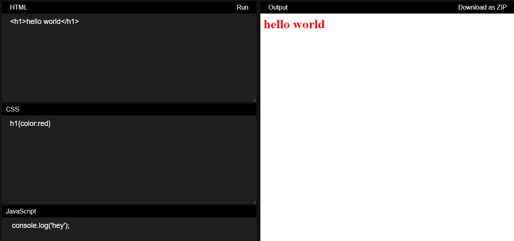

# Web Live Editor

The Web Live Editor is a web-based code editor that allows users to write and preview HTML, CSS, and JavaScript code in real-time. It provides a convenient and interactive environment for web developers.

## Table of Contents

- [Features](#features)
- [Getting Started](#getting-started)
- [live demo](#live-demo)
- [Screenshots](#screenshots)
- [Connect on Social Media](#connect-on-social-media)
- [Contributing](#contributing)
- [License](#license)


## Features

- Live Preview: See the output of your code instantly as you type.
- you can run by run button.
- Download: Download your code as a zip file.


## Getting Started

To get started with the Web Live Editor, follow these steps:

1. Clone the repository or download the source code.
```
git clone https://github.com/AbdurRaahimm/web-live-editor.git
```
2. Open the `index.html` file in your web browser.
3. Start coding and see the live preview in the right pane.

## live demo
Live demo: https://abdurraahimm.github.io/web-live-editor/

## Screenshots



## Connect on Social Media
- [Twitter](https://twitter.com/AbdurRahim4G)
- [Instagram](https://www.instagram.com/abdurrahim4g/)
- [Facebook](https://www.facebook.com/Rahim72446)
- [Facebook](https://www.facebook.com/AbdurRahimm1996)
- [LinkedIn](https://www.linkedin.com/in/abdur-rahim4g/)
- [YouTube](https://youtube.com/@AbdurRahimm)


## Contributing

Contributions are welcome! If you have any ideas, bug reports, or feature requests, please open an issue or submit a pull request on GitHub.

## License

This project is licensed under the [MIT License](LICENSE).
